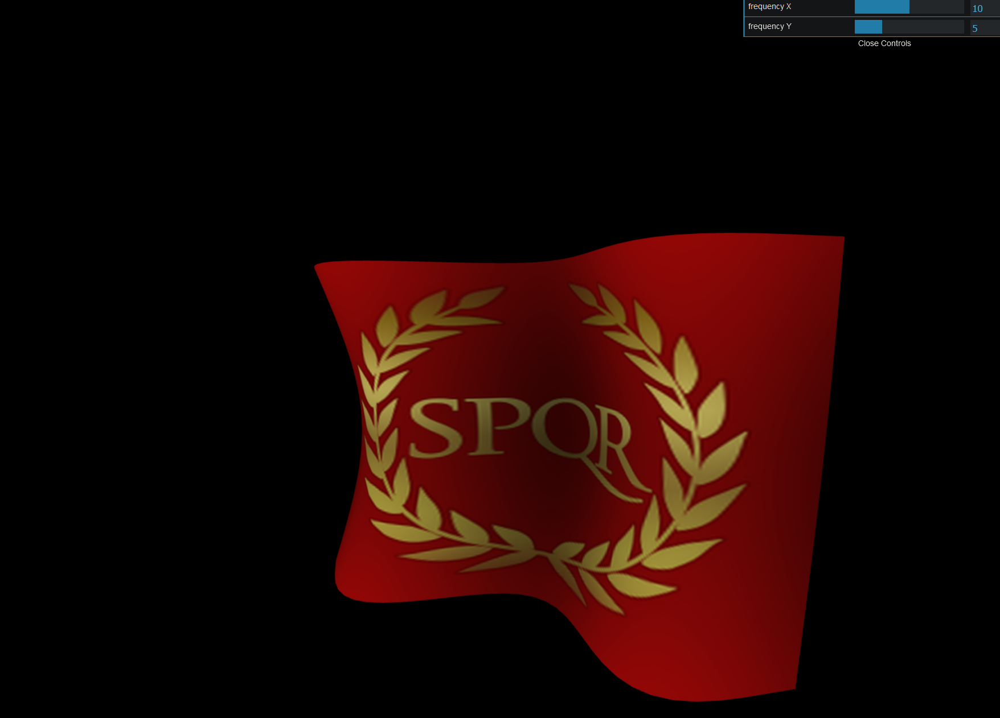

# Three.js Demos

## Collection of small three.js demos





- To run it, you'll need to install [npm](https://docs.npmjs.com/downloading-and-installing-node-js-and-npm) or [yarn](https://classic.yarnpkg.com/en/).
- Open the project folder in the terminal and then run:
````sh
npm install
````
- Then type
````sh
npm run dev
````
or, if you're using yarn:
````sh
yarn dev
````
- Checkout branch of your choice e.g. nighthouse-demo and open: `localchost:3000` in your browser.